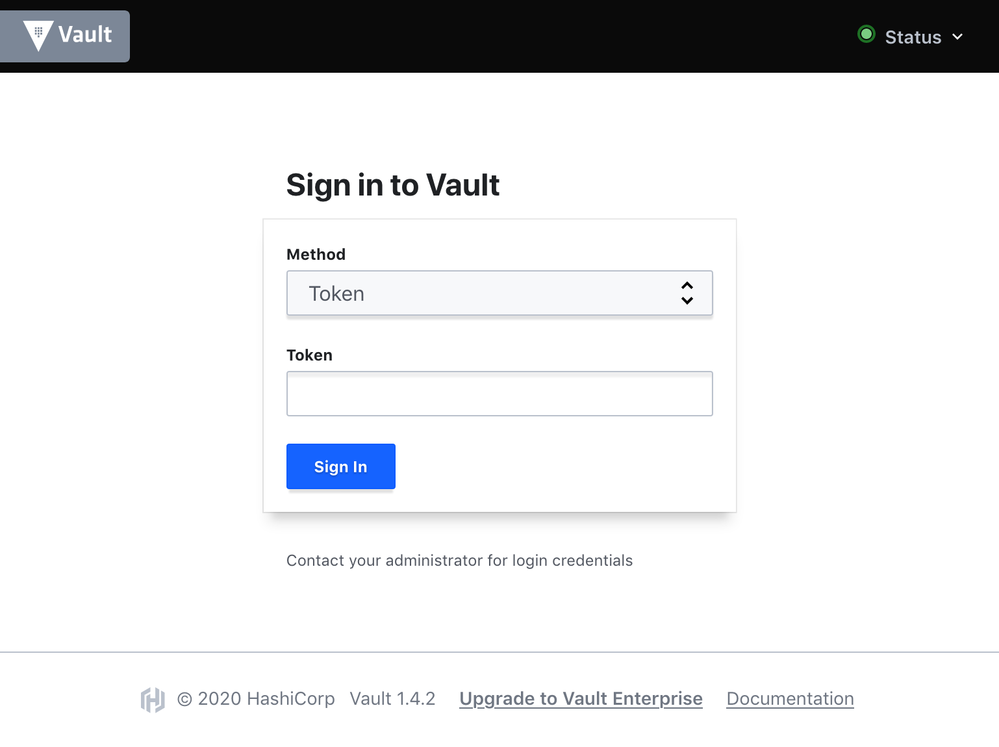

# Gluon Hands-On Lab

In this hands-on lab, we will be exploring the dynamic duo of BOSH
and Kubernetes, via the open source **Gluon** controller, and its
custom resource definitions.  With Gluon, you will be able to
manage BOSH things like cloud-configs, stemcells, and deployments,
from the comfort of your Kubernetes cluster.

We will be using a GKE cluster with the Gluon controllers already
installed, and a BOSH director spun up and ready for deployments.

## Target Audience

This lab is geared towards BOSH operators who would like to
investigate a Kubernetes-first approach to traditional deployments
like VM-based Cloud Foundry.

## Learning Objectives

We will cover the following topics:

  - The Gluon object pipeline
  - Gluon dependencies
  - The use of Kubernetes Jobs

You will perform the following tasks:

  - Connect to the BOSH director using the `gluon` CLI
  - Enumerate the environment (stemcells, cloud-configs, etc.)
  - Deploy a single-node Vault instance

## Prerequisites

Audience must be familiar with BOSH and Kubernetes, both concepts
and commands.

# Instruction

## Setting up Cloud Shell

This lab requires that the `bosh` and `gluon` utilities be
installed in your lab environment.  This repository contains a
`./setup` script that will install those for you, and also connect
the Kubernetes CLI to the correct GKE cluster / namespace.

    $ ./setup

       ######   ##       ##     ##  #######  ##    ##
      ##    ##  ##       ##     ## ##     ## ###   ##
      ##        ##       ##     ## ##     ## ####  ##
      ##   #### ##       ##     ## ##     ## ## ## ##
      ##    ##  ##       ##     ## ##     ## ##  ####
      ##    ##  ##       ##     ## ##     ## ##   ###
       ######   ########  #######   #######  ##    ##

    >> installing gluon command-line utility...
    >> installing bosh command-line utility...
    >> connecting kubectl to gke cluster gluon-lab-cluster-1 in us-east1-c, for summit-labs
    Fetching cluster endpoint and auth data.
    kubeconfig entry generated for gluon-lab-cluster-1.

    >> switching to 'proto' namespace
    Context "gke_summit-labs_us-east1-c_gluon-lab-cluster-1" modified.
    Active namespace is "proto".

    >> setting up `k` alias because we don't have time to type out K-U-B-E-C-T-L...
    >> verifying installation...
       (you should see `bosh env` output below)

    Using environment 'https://34.74.170.247:25555' as client 'admin'

    Name               proto
    UUID               b8c86a80-cd3f-4926-a55a-f5b56c282429
    Version            271.1.0 (00000000)
    Director Stemcell  ubuntu-xenial/621.76
    CPI                google_cpi
    Features           compiled_package_cache: disabled
                       config_server: enabled
                       local_dns: enabled
                       power_dns: disabled
                       snapshots: disabled
    User               admin
    Succeeded

# Introduction to Gluon

For the first part of the lab, James is going to talk for a few
minute about what Gluon is.  As he references YAML files for the
various Gluon custom resources (`BOSHDeployment`, `BOSHConfig`,
and `BOSHStemcell`, feel free to follow along in your Google Cloud
Shell editor, in the `example-*.yml` files, but _PLEASE DO NOT
APPLY THEM TO THE KUBERNETES CLUSTER_.

  - **example-director.yml** - A `BOSHDeployment` for spinning up
    a BOSH director via `bosh create-env` (i.e. from nothing).

  - **example-cloud-config.yml** - A `BOSHConfig` for setting up
    a default BOSH cloud config, so that we can deploy things.

  - **example-stemcell.yml** - A `BOSHStemcell` for getting Xenial
    base OS images onto the BOSH director so it can build Ms.


# Instructions & Tasks

This section details the tasks you will be performing as part of
the hands-on lab.  Each participant will be given a unique number.
We will use these unique numbers to keep your stuff separate from
everything else.

## Getting Around Gluon

1. List the BOSHDeployment, BOSHStemcell, and BOSHConfig resources
   that have already been defined, using the `kubectl` utility.

   ```
   kubectl get boshdeployment,boshstemcell,boshconfig
   ```

2. List the Secrets and ConfigMaps that exist, to find where Gluon
   stashed our BOSH director credentials.

   ```
   kubectl get secret,configmap
   ```

3. Extract the four bits of information we need to talk to our
   `proto` BOSH director, from the `proto-secrets` secret:

   ```
   BOSH_CLIENT=$(kubectl get secret proto-secrets -o template='{{ .data.username | base64decode }}') \
   BOSH_CLIENT_SECRET=$(kubectl get secret proto-secrets -o template='{{ .data.password | base64decode }}') \
   BOSH_CA_CERT=$(kubectl get secret proto-secrets -o template='{{ .data.ca | base64decode }}') \
   BOSH_ENVIRONMENT=$(kubectl get secret proto-secrets -o template='{{ .data.endpoint | base64decode }}') \
     bosh env
   ```

4. Find a better way to do step 3, with the `gluon` utility:

   ```
   gluon @proto env
   ```

5. List the stemcell and BOSH cloud-config for the director

   ```
   gluon @proto stemcells
   gluon @proto cloud-config
   ```
6. List the current BOSH deployments (there should be one Vault)

   ```
   gluon @proto deployments
   ```

## Deploying Vault

Now we're going to use Gluon, and our Kubernetes cluster, to
deploy a single-node Vault deployment to GCP via the `proto` BOSH
director.  This Vault will come with a UI, and we've set up
routing to get from the public internet to the per-seat endpoints
you're each about to deploy.

In fact, to show you what we're going to do, we've gone ahead and
taken seat #199 and deployed it for you -- indeed you may have
seen it in the `bosh deployments` output already.  You can access
this vault by pointing your web browser at
<https://vault199.hol.gluon.starkandwayne.com>.



That's what yours is going to look like.

### Crafting the YAML

In the root of this repository, in your Google Cloud Shell
environment, you'll find a file called `vault.yml`.  It contains
_most_ of a Gluon BOSHDeployment for spinning our Vault.  You'll
need to replace all occurrences of the string `[seat]` with your
seat number (as assigned by the lab proctors), before you can
deploy it.


### Applying the YAML

Once you've modified the `vault.yml` file, you can apply it, in
the `proto` namespace:

    kubens proto
    kubectl apply -f vault.yml


### Watching the Jobs 'n' Pods

Gluon should react to your new BOSHDeployment resource by creating
a Job to deploy your manifest to the BOSH director.  Kubernetes'
built-in controllers should (in turn) create a Pod to actually
execute on the Job's configuration.

We can see both:

    kubectl get jobs | grep vault-[seat]
    kubectl get pods | grep vault-[seat]

If you want to follow along with the deployment, find the Pod
using the above command(s) and run `kubectl logs -f` against it.

### Validating via Gluon 'n' BOSH

While the Vault is deploying, you can also check the BOSH director
(using the `gluon @proto` syntax) for your deployment, and can
follow the deployment task using BOSH tooling, if you desire.

First, verify that you can still talk to the `proto` BOSH
director:

    gluon @proto env

Then, check the deployments list for your Vault:

    gluon @proto deployments | grep vault-[seat]

Check the BOSH tasks for your deployment (if it is still ongoing):

    gluon @proto tasks | grep vault-[seat]

Finally, check the task log (by task ID, above):

    gluon @proto task [id]


### Visiting your Vault on the Web

Once your Vault is deployed, you should be able to access it via
it's public web URL:

    https://vault[seat].hol.gluon.starkandwayne.com


### Congratulations!

You did it!


### Further Reading

Did you enjoy that?  Want to get more involved in Gluon?
Here's some resources!

- **Gluon Homepage** - <https://starkandwayne.com/gluon>
- **Gluon @GitHub** - <https://github.com/starkandwayne/gluon>
